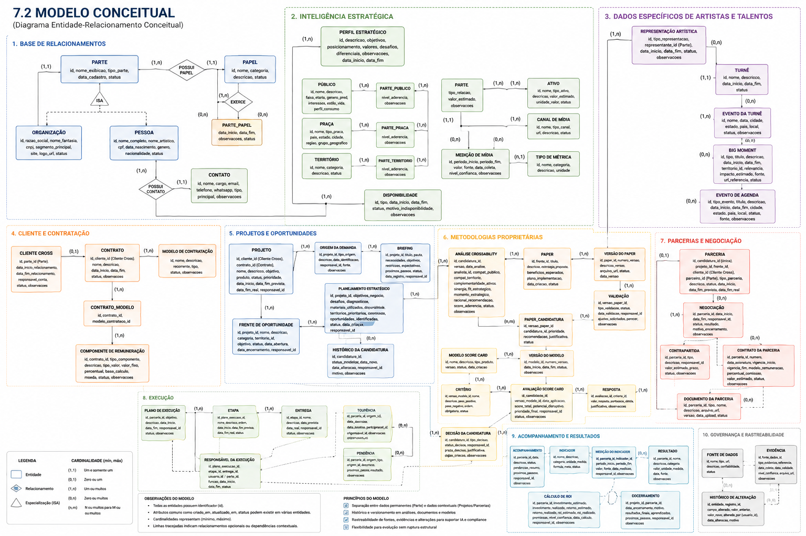
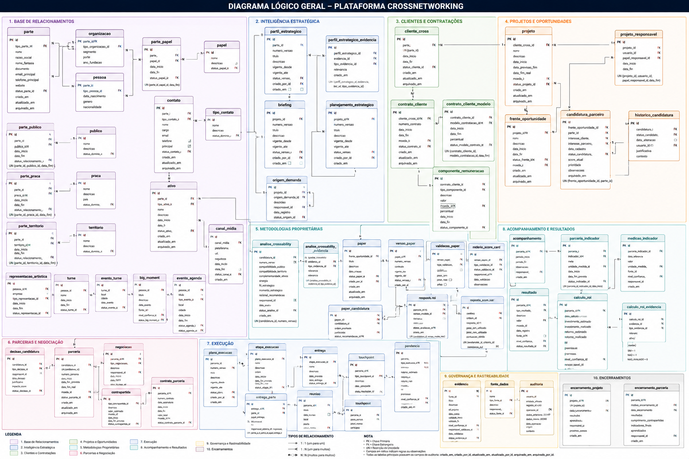

# WAD – Plataforma Cross

## Controle do Documento

- **Projeto:** Plataforma Cross
- **Autor:** Igor da Silva Rodrigues
- **Empresa:** Crossnetworking
- **Data de criação:** 06/07/2026
- **Última atualização:** 08/07/2026
- **Versão:** 0.2
- **Status:** Em andamento

---

# 1. Introdução

## 1.1 Objetivo do Documento

Este documento tem como objetivo registrar e centralizar todas as informações relacionadas ao desenvolvimento da Plataforma Cross, servindo como referência oficial para o projeto ao longo de todo o seu ciclo de vida.

Mais do que documentar os aspectos técnicos da solução, o WAD reúne o entendimento do negócio, o funcionamento operacional da equipe da Crossnetworking e os requisitos levantados. Também consolida as regras de negócio, os fluxos operacionais validados e as decisões tomadas ao longo do projeto, garantindo a rastreabilidade dessas decisões e facilitando a evolução contínua da solução.

Espera-se que este material permita a qualquer integrante da equipe compreender o contexto do projeto, a operação da empresa e a estrutura da solução, reduzindo a dependência de conhecimento tácito e tornando futuras manutenções, evoluções e integrações mais seguras e eficientes.

## 1.2 Visão Geral da Plataforma

A Plataforma Cross é uma aplicação web desenvolvida para reunir as informações e os processos do time de negócios da Crossnetworking, consolidando em uma única base de dados todo o ciclo de vida dos projetos de parceria.

Seu principal objetivo é substituir o modelo atual — baseado em múltiplas planilhas, documentos e ferramentas descentralizadas — por um ambiente integrado que reúna o histórico completo de cada projeto, desde o briefing inicial até o acompanhamento da parceria. Com isso, a plataforma busca garantir maior organização, rastreabilidade das informações, padronização dos processos e preservação do conhecimento operacional da empresa.

Além da consolidação dos dados, a Plataforma Cross serve como base para a aplicação das metodologias proprietárias da Crossnetworking, permitindo estruturar e acompanhar todas as etapas envolvidas na análise, construção e gestão de parcerias estratégicas em um único ambiente.

---

# 2. Contexto do Negócio

## 2.1 Sobre a Crossnetworking

A Crossnetworking é uma empresa especializada no desenvolvimento de parcerias estratégicas entre marcas, atuando na identificação, estruturação, negociação e acompanhamento de iniciativas que gerem valor para seus clientes. Sua atuação combina análise estratégica, conhecimento de mercado e metodologias proprietárias para conectar empresas com objetivos e interesses complementares.

O trabalho da empresa tem início na compreensão do contexto e dos objetivos de negócio de cada cliente. A partir desse entendimento, são conduzidas análises estratégicas que permitem identificar oportunidades de parceria alinhadas às necessidades da organização, considerando aspectos como posicionamento de marca, público-alvo, territórios de atuação e objetivos estratégicos.

Como diferencial, a Crossnetworking utiliza metodologias próprias que estruturam o processo de identificação e avaliação de oportunidades de parceria. Essas metodologias orientam a construção de recomendações estratégicas e apoiam a tomada de decisão ao longo de todas as etapas do projeto, desde o planejamento inicial até a implementação e o acompanhamento das parcerias estabelecidas.

Atualmente, a operação da empresa envolve o uso de diferentes ferramentas e documentos para registrar as informações dos projetos — como planilhas eletrônicas, arquivos compartilhados e plataformas de gestão. Esse cenário motivou o desenvolvimento da Plataforma Cross, concebida para centralizar as informações, padronizar os processos internos e proporcionar uma visão integrada de todo o ciclo de vida dos projetos conduzidos pela empresa.

## 2.2 Funcionamento Atual

O processo operacional da Crossnetworking é composto por um conjunto de etapas que acompanham todo o ciclo de vida de um projeto de parceria estratégica, desde a entrada da demanda até o acompanhamento dos resultados obtidos. Cada fase possui objetivos específicos e utiliza metodologias proprietárias da empresa para apoiar a tomada de decisão e a construção das oportunidades de negócio.

Hoje, esse processo é executado com o apoio de diferentes ferramentas — planilhas eletrônicas, documentos compartilhados e plataformas de gestão —, fazendo com que as informações fiquem dispersas em múltiplas fontes. Como consequência, o histórico completo de cada projeto torna-se fragmentado, dificultando o acompanhamento das atividades e a consolidação do conhecimento.

O fluxo operacional a seguir é a referência central deste documento e é retomado, por meio de citação, nas seções 3.3 e 7.1.

### Fluxo Operacional Atual

```text
CLIENTE
│
├── Modelo de Contratação
│     ├── Fee Mensal
│     ├── Projeto
│     ├── Success Fee
│     └── Outros modelos futuros
│
▼
ORIGEM DA DEMANDA
│
├── Briefing do cliente
└── Oportunidade identificada pela Cross
      (prospecção ativa / concorrências / visão estratégica)
│
▼
PROJETO
│
├── Objetivos
├── Produto
├── Responsável
├── Histórico
└── Status
│
▼
PLANEJAMENTO ESTRATÉGICO
│
├── Consolidação dos materiais existentes
├── Estudos da marca
├── Diagnósticos
├── Objetivos do negócio
├── Desafios
├── Territórios
└── Oportunidades
│
▼
CROSSABILITY
│
├── Aplicação da metodologia proprietária
├── Identificação de territórios prioritários
├── Busca de parceiros
├── Compatibilidade estratégica
└── Recomendação de oportunidades
│
▼
PAPER
│
├── Estratégia proposta
├── Parceiros recomendados
├── Justificativas
├── Benefícios esperados
└── Plano de implementação
│
▼
VALIDAÇÃO
│
├── Validação interna
├── Ajustes estratégicos
└── Aprovação do cliente
│
▼
CROSS SCORE CARD
│
├── Avaliação quantitativa
├── Critérios
├── Pesos
├── Score
├── Potencial disruptivo
└── Priorização final
│
▼
IMPLEMENTAÇÃO
│
├── Prospecção
├── Negociação
├── Estruturação
├── Formalização
└── Gestão das parcerias
│
▼
EXECUÇÃO
│
├── Cronograma
├── Entregas
├── Responsáveis
├── Touchpoints
├── Reuniões
└── Status
│
▼
ACOMPANHAMENTO
│
├── Evolução
├── Resultados
├── Indicadores
├── Histórico
├── Pendências
└── Encerramento
```

### Descrição das Etapas

#### Cliente

Todo projeto inicia com a definição do cliente e do modelo de contratação estabelecido para o serviço. A Crossnetworking atua com diferentes formatos comerciais, como contratos recorrentes (*fee mensal*), projetos pontuais, *success fee* e outros modelos que podem ser adotados conforme a necessidade de cada cliente.

#### Origem da Demanda

A origem de um projeto pode ocorrer de duas formas. A primeira acontece por meio de um briefing fornecido pelo cliente, contendo seus objetivos e necessidades. A segunda ocorre de maneira proativa, quando a própria Crossnetworking identifica oportunidades estratégicas de parceria a partir de prospecções, concorrências ou análises realizadas pela equipe de negócios.

#### Projeto

Após a identificação da demanda, é iniciado o projeto, que passa a concentrar todas as informações relacionadas ao trabalho desenvolvido. Nessa etapa são registrados os objetivos do projeto, o produto ou iniciativa envolvida, os responsáveis pela condução das atividades, além do histórico e do status de evolução.

#### Planejamento Estratégico

O planejamento estratégico consiste na consolidação das informações já existentes sobre a marca e seu contexto de atuação. São analisados materiais previamente produzidos, estudos, diagnósticos, objetivos de negócio, desafios enfrentados, territórios estratégicos e oportunidades identificadas. Essa etapa estabelece a base para todas as análises posteriores.

#### Crossability

Com base nas informações levantadas durante o planejamento, é aplicada a metodologia proprietária Crossability. Seu objetivo é identificar territórios prioritários e encontrar parceiros estrategicamente compatíveis com os objetivos do cliente, considerando o alinhamento entre as organizações e o potencial de geração de valor para ambas as partes.

#### Paper

Os resultados obtidos são consolidados em um documento estratégico denominado *Paper*. Esse material apresenta a estratégia proposta, os parceiros recomendados, as justificativas das recomendações, os benefícios esperados e uma proposta inicial de implementação da parceria.

#### Validação

Antes da continuidade do projeto, o *Paper* é submetido a uma etapa de validação. Inicialmente ocorre uma análise interna da equipe da Crossnetworking, responsável por revisar a estratégia e realizar eventuais ajustes. Após essa validação, o material é apresentado ao cliente para aprovação.

#### Cross Score Card

Após a validação estratégica, é aplicada a metodologia Cross Score Card, responsável por realizar uma avaliação quantitativa das oportunidades identificadas. São considerados critérios previamente definidos, pesos específicos e o potencial disruptivo de cada parceria, permitindo calcular um score e priorizar as alternativas mais aderentes aos objetivos do projeto.

#### Implementação

Com as oportunidades priorizadas, inicia-se a implementação da parceria. Essa etapa contempla atividades como prospecção dos parceiros, negociação entre as partes envolvidas, estruturação das ações, formalização dos acordos e gestão do relacionamento estabelecido.

#### Execução

Durante a execução são acompanhadas todas as atividades planejadas para o projeto. São registrados o cronograma, as entregas realizadas, os responsáveis pelas atividades, os principais pontos de contato entre as equipes, as reuniões realizadas e o status geral da parceria.

#### Acompanhamento

A última etapa corresponde ao acompanhamento contínuo do projeto e da parceria estabelecida. Nela são monitorados os resultados obtidos, os indicadores de desempenho, o histórico das atividades executadas, eventuais pendências e as informações relacionadas ao encerramento do projeto, garantindo a rastreabilidade completa de todo o ciclo de vida da parceria.

## 2.3 Problemas Encontrados

Durante o levantamento de requisitos e o entendimento da operação da Crossnetworking, foram identificados diversos desafios relacionados à gestão das informações, ao acompanhamento dos projetos e à padronização dos processos internos. Esses problemas impactam diretamente a eficiência da equipe de negócios e justificam o desenvolvimento da Plataforma Cross.

### Fragmentação das Informações

As informações de um mesmo projeto encontram-se distribuídas entre diferentes ferramentas, como planilhas eletrônicas, documentos compartilhados e plataformas de gestão. Cada etapa do processo possui registros próprios, o que dificulta a obtenção de uma visão completa do histórico e torna a consulta às informações mais lenta e suscetível a inconsistências.

### Ausência de uma Base Centralizada

Não existe uma fonte única que concentre as informações de clientes, projetos, parceiros e metodologias aplicadas. Como consequência, os colaboradores precisam recorrer a diferentes arquivos para acompanhar a evolução de um projeto, aumentando o tempo gasto na busca por informações.

### Dependência de Planilhas

Grande parte da operação é conduzida por meio de planilhas criadas para atender necessidades específicas de cada cliente ou projeto. Em muitos casos, um único projeto utiliza diversas planilhas distintas, o que dificulta a padronização dos processos e aumenta o esforço de manutenção das informações.

### Falta de Padronização

Ao longo dos anos, diferentes modelos de planilhas e documentos foram criados para atender demandas pontuais. Como resultado, informações semelhantes são registradas de maneiras distintas entre projetos, reduzindo a consistência dos dados e dificultando análises comparativas.

### Baixa Rastreabilidade

O histórico das decisões tomadas ao longo de um projeto encontra-se espalhado por diferentes arquivos e ferramentas. Essa dispersão dificulta a compreensão da evolução das atividades, tornando mais complexo identificar responsáveis, justificativas, alterações realizadas e o andamento de cada etapa.

### Dependência do Conhecimento Individual

Parte significativa do conhecimento operacional permanece concentrada nos colaboradores responsáveis por cada cliente ou projeto. Como muitas informações não estão organizadas em um ambiente centralizado, a continuidade das atividades pode ser comprometida em situações de troca de responsáveis ou de compartilhamento do projeto com outros membros da equipe.

### Retrabalho Operacional

A necessidade de registrar, atualizar e consultar informações em diferentes ferramentas aumenta o volume de atividades operacionais da equipe. Além do retrabalho, esse cenário favorece a duplicidade de dados e eleva o risco de inconsistências entre os registros utilizados ao longo do projeto.

### Dificuldade de Escalabilidade

O modelo atual atende à operação, porém apresenta limitações para suportar o crescimento da empresa. À medida que aumenta o número de clientes, projetos e parcerias conduzidos simultaneamente, torna-se mais difícil manter a organização das informações e garantir a padronização dos processos.

Em conjunto, esses problemas evidenciam a necessidade de uma plataforma capaz de centralizar as informações, organizar o fluxo operacional da Crossnetworking e fornecer uma base única de conhecimento para apoiar a gestão dos projetos e das parcerias estratégicas.

---

# 3. Visão da Solução

## 3.1 Objetivos da Plataforma

A Plataforma Cross tem como propósito centralizar e estruturar o processo operacional da Crossnetworking, reunindo em um único ambiente as informações de clientes, projetos, metodologias e parcerias desenvolvidas pela empresa. Ao substituir o modelo atual — apoiado em múltiplas ferramentas independentes — por uma plataforma integrada, a solução passa a acompanhar todo o ciclo de vida de um projeto com maior controle, rastreabilidade e padronização.

Os principais objetivos da Plataforma Cross são:

- Centralizar todas as informações dos clientes, projetos e parcerias em uma única plataforma.
- Eliminar a fragmentação de dados entre planilhas, documentos e diferentes ferramentas de gestão.
- Padronizar os processos operacionais da equipe de negócios.
- Preservar o histórico completo de cada projeto, garantindo sua rastreabilidade desde a origem da demanda até o encerramento.
- Facilitar o acompanhamento das atividades, responsabilidades, cronogramas e entregas ao longo do ciclo de vida dos projetos.
- Apoiar a execução das metodologias Crossability e Cross Score Card em um ambiente integrado.
- Reduzir o retrabalho decorrente da duplicidade de informações e da necessidade de consultas em múltiplas fontes.
- Disponibilizar uma base de dados estruturada que permita futuras integrações, automações e o uso de recursos de inteligência artificial.

Como resultado, espera-se que a Plataforma Cross aumente a eficiência operacional da Crossnetworking, reduza a dependência de conhecimento individual, fortaleça a padronização dos processos internos e forneça uma visão integrada de todas as etapas envolvidas na gestão das parcerias estratégicas.

## 3.2 Escopo

Esta seção delimita as funcionalidades e os processos contemplados pela Plataforma Cross na versão proposta, bem como as atividades que permanecem fora do escopo do projeto. Essa definição estabelece limites claros para o desenvolvimento da solução e alinha as expectativas quanto às funcionalidades disponibilizadas.

### Dentro do Escopo

A Plataforma Cross contemplará o suporte às principais etapas do processo operacional da Crossnetworking, incluindo:

- Cadastro e gerenciamento de clientes.
- Gerenciamento dos diferentes modelos de contratação.
- Registro da origem das demandas, provenientes de briefings ou de oportunidades identificadas pela equipe da Crossnetworking.
- Gestão completa dos projetos, incluindo objetivos, responsáveis, produtos, histórico e status.
- Estruturação e registro do planejamento estratégico de cada projeto.
- Aplicação e gerenciamento da metodologia Crossability.
- Registro e gerenciamento dos Papers produzidos para cada projeto.
- Fluxo de validação interna e aprovação pelo cliente.
- Aplicação da metodologia Cross Score Card, incluindo critérios, pesos, avaliações e priorização das oportunidades.
- Gestão da implementação das parcerias.
- Acompanhamento da execução dos projetos, incluindo cronogramas, responsáveis, entregas, reuniões e pontos de contato.
- Registro do acompanhamento da parceria, com histórico, indicadores, pendências e encerramento dos projetos.
- Centralização de todas as informações em uma única base de dados.
- Importação das informações atualmente armazenadas em planilhas e documentos utilizados pela operação.
- Integração com ferramentas utilizadas pela Crossnetworking, quando prevista no planejamento do projeto.

### Fora do Escopo

Nesta etapa do desenvolvimento, não fazem parte do escopo da Plataforma Cross:

- Gestão financeira, faturamento e controle contábil.
- Gestão contratual e assinatura eletrônica de documentos.
- Emissão de notas fiscais.
- Sistemas de CRM para prospecção comercial de novos clientes.
- Operação realizada pelos clientes finais da Crossnetworking.
- Automação completa da tomada de decisão das metodologias proprietárias sem validação humana.
- Desenvolvimento de novas metodologias de análise além das já utilizadas pela Crossnetworking.
- Integrações com ferramentas externas não previstas no escopo inicial do projeto.
- Funcionalidades que não estejam relacionadas ao gerenciamento operacional dos projetos e das parcerias estratégicas.

## 3.3 Fluxo Operacional Proposto

Após reuniões com a equipe de negócios, análise das planilhas atualmente utilizadas e validação junto à gestão da Crossnetworking, foi possível consolidar o fluxo operacional da empresa. A Plataforma Cross adotará esse mesmo fluxo — já validado pela equipe e detalhado na seção 2.2 (Funcionamento Atual) —, de forma que a solução reflita fielmente a operação existente.

Esse fluxo servirá de base para as próximas etapas do projeto, orientando a definição dos requisitos, das regras de negócio e da modelagem do domínio da aplicação.

## 3.4 Arquitetura Conceitual e Fluxo de Dados da Plataforma

Embora a Plataforma Cross seja desenvolvida para sustentar o fluxo operacional atualmente utilizado pela Crossnetworking, sua estrutura de dados não será limitada ao gerenciamento de projetos. A solução também funcionará como uma base centralizada de conhecimento sobre as organizações, pessoas, oportunidades e parcerias que fazem parte do ecossistema da empresa.

O fluxo operacional apresentado anteriormente descreve a sequência das atividades realizadas pela Crossnetworking. Já o fluxo conceitual dos dados demonstra como as informações produzidas durante essa operação serão cadastradas, relacionadas, reutilizadas e preservadas pela plataforma.

Essa separação permite que uma organização ou pessoa seja cadastrada uma única vez e participe de diferentes projetos, oportunidades e parcerias ao longo do tempo. Também possibilita a preservação do histórico das análises, decisões, negociações, execuções e resultados obtidos pela empresa.

### Fluxo Conceitual dos Dados

```text
BASE DE RELACIONAMENTOS
│
├── PARTE
│   ├── Organização
│   │   ├── Empresa
│   │   ├── Marca
│   │   ├── Agência
│   │   ├── Fornecedor
│   │   ├── Produtora
│   │   ├── Gravadora
│   │   └── Veículo de mídia
│   │
│   └── Pessoa
│       ├── Artista
│       ├── Influenciador
│       ├── Atleta
│       ├── Especialista
│       ├── Personalidade
│       └── Outro talento
│
├── Papéis
├── Contatos
└── Usuários internos
│
▼
BASE DE INTELIGÊNCIA ESTRATÉGICA
│
├── Perfil estratégico
├── Públicos
├── Praças de atuação
├── Territórios
├── Ativos
├── Canais de mídia
├── Métricas de alcance
├── Disponibilidades
└── Histórico das informações
│
├── Informações específicas de artistas
│   ├── Representações e labels
│   ├── Turnês
│   ├── Eventos das turnês
│   ├── Big Moments
│   └── Eventos de agenda
│
▼
CLIENTE CROSS
│
├── Parte que mantém relacionamento comercial com a Cross
├── Responsável pela conta
├── Status do relacionamento
└── Histórico comercial
│
▼
CONTRATO
│
├── Modelo de contratação
│   ├── Fee mensal
│   ├── Projeto pontual
│   ├── Success Fee
│   └── Outros modelos futuros
│
└── Componentes de remuneração
    ├── Valor mensal
    ├── Valor por projeto
    ├── Comissão por patrocínio
    ├── Comissão por influenciador
    └── Outros formatos de remuneração
│
▼
PROJETO
│
├── Cliente
├── Contrato
├── Origem da demanda
├── Briefing
├── Planejamento estratégico
├── Objetivos
├── Produto ou iniciativa
├── Responsáveis
├── Documentos
├── Histórico
└── Status
│
▼
FRENTE DE OPORTUNIDADE
│
├── Objetivo
├── Categoria
├── Território
├── Responsável
├── Período
└── Status
│
▼
CANDIDATURA DE PARCEIRO
│
├── Parte considerada como possível parceira
├── Interesse do cliente
├── Interesse do parceiro
├── Disponibilidade
├── Prioridade
├── Histórico de movimentações
├── Motivos de recusa
└── Status
│
▼
ANÁLISE CROSSABILITY
│
├── Compatibilidade de públicos
├── Compatibilidade de territórios
├── Complementaridade de ativos
├── Sinergias
├── Fit estratégico
├── Momento estratégico
├── Racional da recomendação
└── Histórico das análises
│
▼
PAPER
│
├── Estratégia proposta
├── Candidaturas recomendadas
├── Justificativas
├── Benefícios esperados
├── Plano de implementação
├── Versões
├── Documentos
└── Validações
│
▼
CROSS SCORE CARD
│
├── Modelo de avaliação
├── Versão do modelo
├── Critérios
├── Pesos
├── Respostas
├── Score total
├── Potencial disruptivo
└── Priorização final
│
▼
DECISÃO DA CANDIDATURA
│
├── Aprovada
├── Rejeitada pelo cliente
├── Recusada pelo parceiro
├── Em negociação
├── Em espera
├── Reabertura da frente
└── Histórico das decisões
│
▼
PARCERIA
│
├── Projeto de origem
├── Frente de origem
├── Cliente
├── Parte parceira
├── Tipo de parceria
├── Negociações
├── Contrapartidas
├── Contrato da parceria
├── Documentos
├── Condições comerciais
└── Status
│
▼
PLANO DE EXECUÇÃO
│
├── Etapas
├── Entregas
├── Responsáveis
├── Cronograma
├── Reuniões
├── Touchpoints
├── Pendências
└── Status
│
▼
ACOMPANHAMENTO E RESULTADOS
│
├── Registros de acompanhamento
├── Indicadores
├── Medições
├── Resultados obtidos
├── Alcance realizado
├── Investimento
├── Retorno estimado
├── Retorno realizado
├── ROI
└── Encerramento
│
▼
BASE HISTÓRICA DA CROSS
│
├── Organizações e pessoas cadastradas
├── Projetos desenvolvidos
├── Oportunidades analisadas
├── Papers e avaliações realizados
├── Parcerias estabelecidas
├── Decisões tomadas
├── Resultados alcançados
└── Aprendizados para futuras iniciativas
│
▼
GOVERNANÇA E RASTREABILIDADE
│
├── Fonte dos dados
├── Evidências
├── Data de coleta
├── Período de validade
├── Nível de confiança
├── Responsável pela validação
├── Histórico de alterações
└── Registro de auditoria
```

### Relação com o Fluxo Operacional

O fluxo conceitual dos dados complementa o fluxo operacional apresentado na seção 2.2. Enquanto o fluxo operacional demonstra como a Crossnetworking conduz um projeto, o fluxo de dados demonstra como cada informação gerada durante esse processo será armazenada e relacionada dentro da plataforma.

```text
FLUXO OPERACIONAL

Cliente
↓
Origem da demanda
↓
Projeto
↓
Planejamento estratégico
↓
Crossability
↓
Paper
↓
Validação
↓
Cross Score Card
↓
Implementação
↓
Execução
↓
Acompanhamento
```

```text
FLUXO DE DADOS DA PLATAFORMA

Parte
↓
Cliente Cross
↓
Contrato
↓
Projeto
↓
Frente de oportunidade
↓
Candidatura de parceiro
↓
Crossability
↓
Paper e validações
↓
Score Card
↓
Decisão
↓
Parceria
↓
Execução
↓
Resultados
↓
Base histórica
```

A principal diferença entre os dois fluxos está no nível de detalhamento. Conceitos como Parte, Candidatura de Parceiro, versões do Paper, decisões, fontes de dados e histórico de alterações não representam necessariamente etapas visíveis da operação, mas são fundamentais para garantir uma estrutura de dados consistente, rastreável e reutilizável.

### Preparação para Evoluções Futuras

A estrutura proposta permitirá que a Plataforma Cross evolua, futuramente, para uma base de conhecimento utilizada por agentes de inteligência artificial. Com os dados organizados, históricos e vinculados às suas fontes, será possível realizar consultas e análises como:

- identificar organizações e pessoas compatíveis com determinado projeto;
- comparar públicos, territórios, ativos e métricas de alcance;
- consultar o histórico de parcerias de uma marca ou artista;
- identificar o momento estratégico mais adequado para uma oportunidade;
- relacionar Big Moments, turnês, lançamentos e agendas com oportunidades de marcas;
- comparar resultados de parcerias anteriores;
- apoiar a elaboração de Papers e análises Crossability;
- estimar resultados e retorno de futuras parcerias.

A arquitetura conceitual busca, portanto, atender às necessidades operacionais atuais da Crossnetworking e, ao mesmo tempo, estabelecer uma base de dados sólida para o crescimento da plataforma, a produção de análises estratégicas e a adoção futura de mecanismos de inteligência artificial.

---

# 4. Domínio do Negócio

## 4.1 Mapa de Domínio

(Liste todas as entidades principais e seus relacionamentos.)

## 4.2 Glossário

(Defina os termos: Cliente, Projeto, Frente, Parceiro, Crossability, Paper, Score Card, Execução, etc.)

---

# 5. Levantamento de Requisitos

## 5.1 Requisitos Funcionais

- RF001 – 
- RF002 – 
- ...

## 5.2 Requisitos Não Funcionais

- RNF001 – 
- RNF002 – 
- ...

---

# 6. Regras de Negócio

- RN001 – 
- RN002 – 
- RN003 – 
- ...

---

# 7. Modelagem do Sistema

## 7.1 Mapa de Domínio

O mapa de domínio da Plataforma Cross foi construído a partir de duas perspectivas complementares: o fluxo operacional da Crossnetworking, apresentado na seção 2.2, e o fluxo conceitual dos dados da plataforma, apresentado na seção 3.4.

Enquanto o fluxo operacional representa a sequência das atividades realizadas pela empresa, o fluxo conceitual identifica os principais elementos de informação necessários para sustentar essa operação. A combinação dessas duas perspectivas serviu como base para a identificação das entidades, dos relacionamentos e dos módulos apresentados no Modelo Conceitual.

## 7.2 Modelo Conceitual

O Modelo Conceitual tem como objetivo representar, em alto nível, a estrutura de dados necessária para suportar os processos de negócio da Crossnetworking, independentemente de detalhes técnicos de implementação. Nesta etapa são identificadas as principais entidades do domínio, seus atributos essenciais e os relacionamentos existentes entre elas, garantindo que as regras de negócio levantadas durante o processo de análise estejam corretamente refletidas na estrutura da plataforma.

Diferentemente do Mapa de Domínio, que descreve o fluxo operacional da empresa e a interação entre suas metodologias, o Modelo Conceitual traduz esses conceitos para uma visão orientada a dados, servindo como base para a construção do modelo lógico e, posteriormente, do modelo físico do banco de dados.

A modelagem foi estruturada em módulos que representam os principais pilares da plataforma, contemplando o cadastro de organizações e pessoas, inteligência estratégica, projetos, oportunidades, metodologias proprietárias (Crossability e Cross Score Card), parcerias, execução, acompanhamento de resultados e governança dos dados. Essa organização busca garantir alta coesão entre os componentes do sistema, facilitar sua evolução ao longo do tempo e permitir futuras integrações com mecanismos de inteligência artificial e análise estratégica.

A Figura 7.2 apresenta o Diagrama Entidade-Relacionamento (DER) conceitual proposto para a Plataforma Cross.

<div align="center">
  <sub>Figura 1 — Modelo Entidade Relacionamento ER - Crossnetworking</sub><br>
  <br>
  <sup>Fonte: Autores, 2026.</sup>
</div>


## 7.3 Modelo Lógico

O Modelo Lógico da Plataforma Cross traduz as entidades e os relacionamentos definidos no Modelo Conceitual para uma estrutura relacional detalhada. Nesta etapa são estabelecidas as tabelas, seus atributos, chaves primárias, chaves estrangeiras, cardinalidades, obrigatoriedades, domínios controlados, restrições de unicidade e regras de integridade.

O objetivo desta modelagem é garantir que o banco de dados não apenas armazene as informações da operação da Crossnetworking, mas também preserve sua consistência, rastreabilidade e evolução ao longo do tempo.

A estrutura foi organizada nos seguintes domínios:

1. Base de Relacionamentos;
2. Inteligência Estratégica;
3. Artistas e Talentos;
4. Clientes e Contratações;
5. Projetos e Oportunidades;
6. Metodologias Proprietárias;
7. Parcerias e Negociação;
8. Execução;
9. Acompanhamento e Resultados;
10. Governança e Rastreabilidade.

---

### 7.3.1 Convenções Gerais

As seguintes convenções deverão ser aplicadas em todo o modelo:

- Tabelas e atributos utilizarão o padrão `snake_case`.
- As chaves primárias serão identificadas por `id`.
- As chaves estrangeiras seguirão o padrão `<entidade>_id`.
- Os identificadores serão representados por UUID.
- Datas e horários operacionais serão armazenados com informação de fuso horário.
- Valores monetários utilizarão precisão decimal e moeda no padrão ISO 4217.
- Relações muitos-para-muitos serão representadas por tabelas associativas.
- Entidades de negócio utilizarão exclusão lógica quando seus dados possuírem valor histórico.
- Informações estratégicas não serão sobrescritas quando precisarem de histórico.
- Status, tipos, categorias e prioridades utilizarão vocabulários controlados.
- Dados calculados possuirão uma única fonte oficial de cálculo.
- Dados estratégicos deverão preservar origem, data de coleta, validade, nível de confiança e responsável pela validação.
- Rótulos apresentados na interface não serão utilizados como identificadores internos.

---

### 7.3.2 Colunas de Controle e Auditoria

As tabelas de negócio deverão possuir, quando aplicável, o seguinte conjunto mínimo de atributos:

| Atributo | Descrição |
|---|---|
| `id` | Identificador único do registro |
| `criado_em` | Data e horário da criação |
| `criado_por_id` | Usuário responsável pela criação |
| `atualizado_em` | Data e horário da última alteração |
| `atualizado_por_id` | Usuário responsável pela última alteração |
| `arquivado_em` | Data e horário do arquivamento lógico |
| `arquivado_por_id` | Usuário responsável pelo arquivamento |

O estado funcional do registro será representado por um status específico do seu domínio, e não por um status global compartilhado entre todas as tabelas.

Tabelas associativas simples, catálogos estáticos e registros imutáveis poderão utilizar um conjunto reduzido de atributos, desde que a exceção esteja documentada no dicionário de dados.

---

### 7.3.3 Vocabulários Controlados por Domínio

Cada contexto possuirá seu próprio conjunto de status e tipos permitidos.

Não será utilizado um único catálogo global de status, pois isso permitiria, por exemplo, associar um status de candidatura a um projeto.

Serão definidos catálogos ou tipos controlados específicos, como:

```text
status_parte
status_cliente
status_contrato
status_projeto
status_frente
status_candidatura
status_crossability
status_paper
status_validacao
status_avaliacao_score_card
status_parceria
status_negociacao
status_execucao
status_entrega
status_pendencia
```

Exemplo de domínio para candidatura:

```text
STATUS_CANDIDATURA
├── identificada
├── em_analise
├── recomendada
├── apresentada
├── aprovada
├── recusada_cliente
├── recusada_parceiro
├── em_negociacao
├── stand_by
└── encerrada
```

Como regra:

- Conjuntos pequenos e extremamente estáveis poderão utilizar tipos enumerados.
- Conjuntos sujeitos a evolução ou administração utilizarão tabelas de referência.
- O código interno deverá permanecer estável mesmo que o rótulo apresentado ao usuário seja alterado.

---

### 7.3.4 Especialização de Parte

A tabela `parte` será o supertipo utilizado para representar os diferentes participantes do ecossistema da Crossnetworking.

```text
PARTE
├── ORGANIZAÇÃO
└── PESSOA
```

Cada parte deverá possuir exatamente uma especialização.

#### Regras

- Uma parte do tipo `organizacao` deverá possuir um registro correspondente em `organizacao`.
- Uma parte do tipo `pessoa` deverá possuir um registro correspondente em `pessoa`.
- Uma parte não poderá possuir simultaneamente as duas especializações.
- Organizações e pessoas serão referenciadas de forma uniforme por meio de `parte_id` em oportunidades, parcerias, contatos e demais relações compartilhadas.

Essa especialização deverá ser garantida transacionalmente no Modelo Físico.

---

### 7.3.5 Dados Permanentes e Contextuais

Os dados permanentes deverão ser separados daqueles que só possuem significado dentro de um projeto, oportunidade ou parceria.

#### Dados permanentes

```text
identificação
perfil estratégico
contatos
públicos
praças
territórios
ativos
canais de mídia
métricas
representações
turnês
agenda
Big Moments
```

#### Dados contextuais

```text
interesse do cliente
interesse do parceiro
prioridade na frente
score
motivo de recusa
negociação
contrapartida
investimento
retorno
resultado
```

Dados contextuais deverão estar vinculados à candidatura, frente, projeto ou parceria correspondente, nunca diretamente ao cadastro geral da parte.

---

### 7.3.6 Estratégia de Exclusão Lógica e Unicidade

As entidades que possuem valor histórico utilizarão exclusão lógica por meio de `arquivado_em`.

As restrições de unicidade deverão considerar apenas registros ativos quando for permitido recriar ou reativar um relacionamento anteriormente arquivado.

Exemplo:

```text
Uma parte não pode aparecer duas vezes simultaneamente na mesma frente.
Porém, uma candidatura arquivada não deve impedir uma futura reentrada.
```

A regra lógica será:

```text
UNIQUE (frente_id, parte_id)
APENAS PARA REGISTROS NÃO ARQUIVADOS
```

O mesmo padrão será aplicado, quando necessário, a:

- vínculos ativos de cliente;
- papéis ativos de uma parte;
- contatos principais;
- versões vigentes;
- contratos ativos;
- candidaturas ativas;
- parcerias ativas;
- responsáveis ativos;
- associações vigentes entre partes e públicos, praças ou territórios.

As restrições parciais serão implementadas no Modelo Físico por índices únicos condicionais.

---

### 7.3.7 Estado Atual e Histórico de Movimentações

O estado atual das entidades operacionais será armazenado como uma projeção controlada em suas respectivas tabelas.

Exemplos:

```text
projeto.status_projeto_id
frente.status_frente_id
candidatura.status_candidatura_id
parceria.status_parceria_id
entrega.status_entrega_id
```

Esse estado deverá ser atualizado exclusivamente por operações transacionais que também registrem o evento correspondente no histórico.

Exemplo para candidatura:

```text
CANDIDATURA
├── status atual
└── HISTÓRICO DA CANDIDATURA
    ├── status anterior
    ├── status novo
    ├── data
    ├── responsável
    ├── justificativa
    └── contexto
```

Dessa forma:

- consultas operacionais utilizarão a coluna de estado atual;
- auditorias e reconstruções utilizarão o histórico;
- alterações de estado não poderão ocorrer sem o respectivo registro histórico.

O estado atual não será calculado em todas as consultas a partir do último evento, evitando complexidade e degradação de desempenho.

---

### 7.3.8 Estratégia de Versionamento

As entidades estratégicas que evoluem ao longo do tempo deverão preservar versões explícitas.

Serão versionados:

- Perfil Estratégico;
- Briefing;
- Planejamento Estratégico;
- Análise Crossability;
- Paper;
- Modelo de Score Card;
- Plano de Execução;
- documentos estratégicos, quando necessário.

Cada versão deverá possuir:

```text
numero_versao
criado_em
criado_por_id
vigente_desde
vigente_ate
status_versao
```

A versão vigente será identificada por uma restrição que permita apenas uma versão ativa por entidade principal.

Exemplo:

```text
PAPER
1:N
VERSAO_PAPER
```

Regra:

```text
Apenas uma versão não arquivada e marcada como vigente poderá existir para cada Paper.
```

A versão vigente não será determinada apenas por `MAX(numero_versao)`, pois uma versão mais recente pode estar em rascunho enquanto uma anterior permanece publicada.

Os estados de versão poderão incluir:

```text
rascunho
em_revisao
vigente
substituida
cancelada
```

---

### 7.3.9 Cliente, Contratos e Modelos Comerciais

`cliente_cross` representa o vínculo comercial entre uma parte e a Crossnetworking, sem duplicar os dados cadastrais da organização ou pessoa.

```text
PARTE
1:0..1
CLIENTE_CROSS
```

#### Regras

- Uma parte poderá possuir no máximo um vínculo ativo como cliente Cross.
- Um cliente poderá possuir vários contratos ao longo do tempo.
- Um contrato poderá possuir mais de um modelo de contratação.
- Um contrato poderá possuir vários componentes de remuneração.
- Projetos poderão ser vinculados a um contrato específico.
- O contrato poderá ser opcional na criação inicial do projeto, desde que sua formalização posterior seja controlada.

Estrutura:

```text
CLIENTE_CROSS
1:N
CONTRATO_CLIENTE

CONTRATO_CLIENTE
N:N
MODELO_CONTRATACAO

CONTRATO_CLIENTE
1:N
COMPONENTE_REMUNERACAO
```

Exemplos de componentes:

- valor mensal;
- valor fechado por projeto;
- comissão por patrocínio;
- comissão por influenciador;
- percentual sobre negócio fechado.

---

### 7.3.10 Projeto, Frente e Candidatura

```text
CLIENTE_CROSS
1:N
PROJETO

PROJETO
1:N
FRENTE_OPORTUNIDADE

FRENTE_OPORTUNIDADE
1:N
CANDIDATURA_PARCEIRO

PARTE
1:N
CANDIDATURA_PARCEIRO
```

#### Projeto

- Todo projeto deverá pertencer a um cliente.
- Um projeto poderá possuir várias origens de demanda registradas historicamente.
- Um projeto poderá possuir várias versões de briefing e planejamento.
- Um projeto deverá possuir ao menos um responsável interno ativo.

#### Frente

- Toda frente deverá pertencer a um único projeto.
- Uma frente poderá existir inicialmente sem candidaturas.
- Uma frente poderá ser reaberta sem perder seu histórico anterior.

#### Candidatura

A candidatura representa uma parte sendo analisada como possível parceira dentro de uma frente específica.

Regras:

- Toda candidatura deverá apontar para exatamente uma parte.
- A mesma parte não poderá possuir duas candidaturas ativas na mesma frente.
- Interesse do cliente e interesse do parceiro utilizarão vocabulários controlados.
- Recusas deverão registrar origem, responsável, justificativa e data.
- A candidatura poderá possuir várias análises, avaliações e decisões.
- O estado atual será preservado juntamente com seu histórico de movimentações.

---

### 7.3.11 Análise Crossability

```text
CANDIDATURA_PARCEIRO
1:N
ANALISE_CROSSABILITY
```

Cada análise deverá preservar:

- versão;
- compatibilidade de público;
- compatibilidade de território;
- complementaridade de ativos;
- sinergia;
- fit estratégico;
- momento estratégico;
- racional da recomendação;
- responsável;
- data da análise;
- evidências utilizadas;
- status.

A combinação entre candidatura e versão deverá ser única:

```text
UNIQUE (candidatura_id, numero_versao)
```

Uma nova análise não poderá sobrescrever análises anteriores.

---

### 7.3.12 Paper e Validação

```text
FRENTE_OPORTUNIDADE
1:N
PAPER

PAPER
1:N
VERSAO_PAPER

PAPER
N:N
CANDIDATURA_PARCEIRO

VERSAO_PAPER
1:N
VALIDACAO_PAPER
```

O Paper pertence a uma frente e poderá recomendar várias candidaturas.

A relação entre Paper e candidatura deverá armazenar:

- ordem de prioridade;
- justificativa;
- recomendação;
- status da recomendação.

A validação sempre deverá apontar para uma versão específica do Paper.

Tipos de validação:

```text
interna
cliente
juridica
comercial
outra
```

Uma versão só poderá ser considerada aprovada quando atender às validações obrigatórias definidas para o processo.

---

### 7.3.13 Cross Score Card

A avaliação do Cross Score Card ocorrerá somente após a validação do Paper correspondente.

Estrutura:

```text
MODELO_SCORE_CARD
1:N
VERSAO_MODELO_SCORE_CARD

VERSAO_MODELO_SCORE_CARD
1:N
CRITERIO_SCORE_CARD

CANDIDATURA_PARCEIRO
1:N
AVALIACAO_SCORE_CARD

AVALIACAO_SCORE_CARD
1:N
RESPOSTA_SCORE_CARD

CRITERIO_SCORE_CARD
1:N
RESPOSTA_SCORE_CARD
```

#### Domínio de respostas

```text
SIM
NAO
NAO_AVALIADO
```

#### Regra de pontuação

```text
SIM          → peso_sim
NAO          → peso_nao
NAO_AVALIADO → 0
```

O potencial disruptivo deverá possuir valor entre 1 e 5.

O score será calculado por:

```text
score_total =
soma das pontuações obtidas nas respostas
+
potencial_disruptivo
```

#### Estratégia oficial de cálculo

A engine da aplicação será responsável pelo cálculo determinístico do Score Card, enquanto o banco realizará a validação e preservação dos valores utilizados.

A aplicação deverá enviar, dentro de uma mesma transação:

- resposta selecionada;
- pesos da versão do critério;
- pontuação calculada;
- potencial disruptivo;
- score total.

O banco deverá validar:

- se os pesos correspondem à versão do critério;
- se a pontuação corresponde à resposta;
- se o potencial está entre 1 e 5;
- se o score total corresponde à soma das respostas mais o potencial disruptivo.

Nenhum usuário poderá editar manualmente `pontuacao_obtida` ou `score_total`.

Para cada avaliação deverá existir apenas uma resposta por critério:

```text
UNIQUE (avaliacao_id, criterio_id)
```

---

### 7.3.14 Decisão e Criação da Parceria

```text
CANDIDATURA_PARCEIRO
1:N
DECISAO_CANDIDATURA

CANDIDATURA_PARCEIRO
1:0..1
PARCERIA
```

Uma candidatura poderá possuir várias decisões históricas.

Exemplos:

```text
priorizada
aprovada
rejeitada_cliente
recusada_parceiro
stand_by
em_negociacao
reaberta
encerrada
```

Uma parceria somente poderá ser criada quando:

- existir uma decisão de aprovação;
- o Paper correspondente estiver validado;
- a candidatura tiver concluído o processo mínimo de avaliação definido pela Cross.

Uma candidatura poderá gerar no máximo uma parceria ativa.

Caso uma parceria seja encerrada e posteriormente reaberta sob novas condições, deverá ser criado um novo ciclo de parceria, preservando o histórico anterior.

---

### 7.3.15 Disponibilidade

A disponibilidade poderá estar associada:

- diretamente a uma parte; ou
- a um ativo específico pertencente a uma parte.

Como o ativo já determina seu proprietário, a estrutura deverá evitar redundância.

Regra:

```text
A disponibilidade deve possuir parte_id ou ativo_id,
mas nunca ambos simultaneamente.
```

Caso `ativo_id` esteja preenchido, a parte será obtida por meio do ativo.

As datas deverão obedecer:

```text
data_fim >= data_inicio
```

---

### 7.3.16 Documentos

Será utilizado um núcleo central de documentos.

```text
DOCUMENTO
├── nome
├── tipo
├── versão
├── localização
├── hash
├── criado_por
├── criado_em
└── status
```

Tabelas associativas vincularão documentos a:

- projetos;
- briefings;
- planejamentos;
- Papers;
- contratos;
- parcerias;
- planos de execução;
- evidências.

Essa abordagem evita estruturas repetidas como `documento_projeto`, `documento_paper` e `documento_parceria` contendo os mesmos atributos.

O arquivo não será armazenado diretamente no banco relacional. O banco armazenará sua localização, metadados, hash e versionamento.

---

### 7.3.17 Execução

```text
PARCERIA
1:N
PLANO_EXECUCAO

PLANO_EXECUCAO
1:N
ETAPA_EXECUCAO

ETAPA_EXECUCAO
1:N
ENTREGA

ENTREGA
N:N
PARTE

PARCERIA
1:N
REUNIAO

REUNIAO
N:N
PARTE

PARCERIA
1:N
TOUCHPOINT

PARCERIA
1:N
PENDENCIA
```

Responsáveis internos deverão ser vinculados a usuários da plataforma.

Responsáveis externos poderão ser vinculados a partes.

As relações de responsabilidade deverão indicar:

- função;
- início;
- fim;
- status;
- contexto da responsabilidade.

Pendências poderão estar relacionadas a:

- parceria;
- etapa;
- entrega.

Uma pendência sempre deverá possuir parceria e poderá, opcionalmente, especificar etapa ou entrega.

---

### 7.3.18 Acompanhamento, Indicadores e ROI

```text
PARCERIA
1:N
ACOMPANHAMENTO

PARCERIA
N:N
INDICADOR

PARCERIA
1:N
MEDICAO_INDICADOR

PARCERIA
1:N
RESULTADO

PARCERIA
1:N
CALCULO_ROI
```

Cada medição deverá registrar:

- indicador;
- período;
- valor;
- unidade;
- fonte;
- responsável;
- data de coleta;
- nível de confiança.

Os cálculos de ROI deverão preservar:

- investimento estimado;
- investimento realizado;
- retorno estimado;
- retorno realizado;
- moeda;
- premissas;
- nível de confiança;
- responsável;
- data de cálculo.

O ROI deverá ser calculado com base em:

```text
ROI =
(retorno - investimento)
/
investimento
```

Nenhum cálculo de ROI deverá sobrescrever um cálculo anterior. Cada cálculo será um registro histórico independente.

---

### 7.3.19 Encerramento

Projeto e parceria possuirão encerramentos separados.

```text
PROJETO
1:0..1
ENCERRAMENTO_PROJETO

PARCERIA
1:0..1
ENCERRAMENTO_PARCERIA
```

O encerramento do projeto deverá registrar:

- motivo;
- resultados gerais;
- aprendizados;
- responsável;
- data;
- próximos passos.

O encerramento da parceria deverá registrar:

- motivo;
- resultados;
- cumprimento das contrapartidas;
- indicadores finais;
- aprendizados;
- responsável;
- data.

Essa separação elimina associações polimórficas e permite regras específicas para cada processo.

---

### 7.3.20 Evidências e Proveniência

As evidências serão vinculadas aos registros de negócio por meio de tabelas associativas específicas.

Exemplos:

```text
perfil_estrategico_evidencia
analise_crossability_evidencia
medicao_midia_evidencia
big_moment_evidencia
resultado_evidencia
calculo_roi_evidencia
```

Essa escolha preserva integridade referencial e evita estruturas polimórficas baseadas em nomes de tabelas e identificadores livres.

Cada evidência deverá possuir:

- fonte;
- título;
- descrição;
- URL ou arquivo;
- data de coleta;
- período de validade;
- nível de confiança;
- responsável pela validação;
- data de validação;
- status.

---

### 7.3.21 Estratégia de Auditoria

A Plataforma Cross adotará uma estratégia híbrida de auditoria:

1. colunas de controle nas tabelas de negócio;
2. versionamento explícito nas entidades estratégicas;
3. históricos de eventos para mudanças relevantes;
4. auditoria técnica com dados anteriores e posteriores.

Estrutura lógica:

```text
AUDITORIA
├── usuario_id
├── entidade_afetada
├── registro_id
├── operacao
├── dados_anteriores
├── dados_novos
├── data_operacao
├── origem
└── contexto
```

Os valores anteriores e posteriores deverão preservar os tipos dos dados em uma estrutura adequada, sem depender exclusivamente de colunas de texto por campo.

Entidades já versionadas, como Paper, Perfil Estratégico e Score Card, não dependerão exclusivamente da auditoria genérica para preservar seu histórico.

---

### 7.3.22 Valores Monetários

Todo valor monetário deverá utilizar o mesmo padrão:

```text
valor NUMERIC
moeda CHAR(3)
```

A moeda seguirá o padrão ISO 4217:

```text
BRL
USD
EUR
```

Percentuais deverão utilizar precisão decimal consistente e permanecer dentro do intervalo permitido.

Regras:

```text
valor >= 0
percentual >= 0
percentual <= 100
```

Valores monetários nunca serão armazenados em tipos de ponto flutuante.

---

### 7.3.23 Temporalidade

As seguintes regras serão aplicadas:

```text
data_fim >= data_inicio
vigente_ate >= vigente_desde
periodo_fim >= periodo_inicio
data_encerramento >= data_inicio
```

Quando uma entidade possuir `vigente_desde` e `vigente_ate`, sua vigência deverá ser determinada pelas datas.

Um status adicional só deverá existir quando representar outra dimensão funcional, como:

```text
rascunho
publicado
suspenso
cancelado
```

---

### 7.3.24 Nullability

A obrigatoriedade de cada atributo será documentada no dicionário de dados.

Como regra:

- relações essenciais serão obrigatórias;
- descrições complementares poderão ser opcionais;
- estados conhecidos não serão representados por `NULL`;
- campos calculados não serão editáveis;
- atributos opcionais deverão possuir justificativa funcional;
- campos vazios não serão usados para representar respostas ou status conhecidos.

Exemplo:

```text
Resposta ainda não avaliada = NAO_AVALIADO
Resposta desconhecida por falha de importação = NULL
```

---

### 7.3.25 Relações Estruturais Consolidadas

```text
PARTE
├── ORGANIZACAO
└── PESSOA

PARTE N:N PAPEL
PARTE 1:N CONTATO
PARTE 1:N PERFIL_ESTRATEGICO
PARTE N:N PUBLICO
PARTE N:N PRACA
PARTE N:N TERRITORIO
PARTE 1:N ATIVO
PARTE 1:N CANAL_MIDIA
CANAL_MIDIA 1:N MEDICAO_MIDIA

PESSOA 1:N REPRESENTACAO_ARTISTICA
PESSOA 1:N TURNE
TURNE 1:N EVENTO_TURNE
PESSOA 1:N BIG_MOMENT
PESSOA 1:N EVENTO_AGENDA

PARTE 1:0..1 CLIENTE_CROSS
CLIENTE_CROSS 1:N CONTRATO_CLIENTE
CONTRATO_CLIENTE N:N MODELO_CONTRATACAO
CONTRATO_CLIENTE 1:N COMPONENTE_REMUNERACAO

CLIENTE_CROSS 1:N PROJETO
PROJETO 1:N ORIGEM_DEMANDA
PROJETO 1:N BRIEFING
PROJETO 1:N PLANEJAMENTO_ESTRATEGICO
PROJETO 1:N FRENTE_OPORTUNIDADE

FRENTE_OPORTUNIDADE 1:N CANDIDATURA_PARCEIRO
PARTE 1:N CANDIDATURA_PARCEIRO
CANDIDATURA_PARCEIRO 1:N HISTORICO_CANDIDATURA

CANDIDATURA_PARCEIRO 1:N ANALISE_CROSSABILITY

FRENTE_OPORTUNIDADE 1:N PAPER
PAPER 1:N VERSAO_PAPER
PAPER N:N CANDIDATURA_PARCEIRO
VERSAO_PAPER 1:N VALIDACAO_PAPER

MODELO_SCORE_CARD 1:N VERSAO_MODELO_SCORE_CARD
VERSAO_MODELO_SCORE_CARD 1:N CRITERIO_SCORE_CARD
CANDIDATURA_PARCEIRO 1:N AVALIACAO_SCORE_CARD
AVALIACAO_SCORE_CARD 1:N RESPOSTA_SCORE_CARD
CRITERIO_SCORE_CARD 1:N RESPOSTA_SCORE_CARD

CANDIDATURA_PARCEIRO 1:N DECISAO_CANDIDATURA
CANDIDATURA_PARCEIRO 1:0..1 PARCERIA

PARCERIA 1:N NEGOCIACAO
PARCERIA 1:N CONTRAPARTIDA
PARCERIA 1:N CONTRATO_PARCERIA
PARCERIA 1:N PLANO_EXECUCAO

PLANO_EXECUCAO 1:N ETAPA_EXECUCAO
ETAPA_EXECUCAO 1:N ENTREGA
ENTREGA N:N PARTE
PARCERIA 1:N REUNIAO
REUNIAO N:N PARTE
PARCERIA 1:N TOUCHPOINT
PARCERIA 1:N PENDENCIA

PARCERIA 1:N ACOMPANHAMENTO
PARCERIA N:N INDICADOR
PARCERIA 1:N MEDICAO_INDICADOR
PARCERIA 1:N RESULTADO
PARCERIA 1:N CALCULO_ROI

PROJETO 1:0..1 ENCERRAMENTO_PROJETO
PARCERIA 1:0..1 ENCERRAMENTO_PARCERIA
```

---

### 7.3.26 Artefatos Complementares

O Modelo Lógico será acompanhado pelos seguintes artefatos:

1. Diagrama lógico geral;
2. Diagramas detalhados por domínio;
3. Dicionário de dados;
4. Catálogo de vocabulários controlados;
5. Matriz de relacionamentos e cardinalidades;
6. Catálogo de constraints;
7. Registros de decisões arquiteturais;
8. Estratégia preliminar de índices;
9. Casos de teste de integridade;
10. Plano de migração dos dados existentes em planilhas.

Esses artefatos serão utilizados como entrada direta para a construção do Modelo Físico em PostgreSQL.

---

### Conclusão

O Modelo Lógico consolida a estrutura relacional da Plataforma Cross e estabelece as regras necessárias para preservar a integridade dos dados ao longo do tempo.

A modelagem diferencia informações permanentes de dados contextuais, mantém o histórico das análises e decisões, controla versões, restringe os vocabulários de negócio e define responsabilidades claras entre organizações, pessoas, projetos, candidaturas e parcerias.

Com as decisões apresentadas nesta seção, o modelo encontra-se apto para avançar para o Modelo Físico, no qual serão definidos os tipos de dados do PostgreSQL, constraints, índices, triggers, políticas de segurança e scripts de criação do banco.

<div align="center">
  <sub>Figura 2 - Diagrama lógico geral - Crossnetworking</sub><br>
  <br>
  <sup>Fonte: Autores, 2026.</sup>
</div>


## 7.4 Modelo Físico

O Modelo Físico da Plataforma Cross representa a implementação do Modelo Lógico no Sistema Gerenciador de Banco de Dados escolhido para o projeto. Nesta etapa são definidos os tipos de dados, constraints, índices, estratégias de exclusão lógica, controle de versões, auditoria, segurança e organização dos scripts responsáveis pela criação e evolução do banco.

O banco de dados será implementado utilizando **PostgreSQL 16**, considerando sua robustez transacional, suporte a relacionamentos complexos, índices avançados, tipos especializados, funções, triggers, políticas de segurança e extensões que poderão apoiar futuras funcionalidades de inteligência artificial.

A estrutura física deverá refletir integralmente as regras definidas no Modelo Lógico, garantindo que dados inválidos ou inconsistentes sejam impedidos não apenas pela aplicação, mas também pelo próprio banco de dados.

---

### 7.4.1 Tecnologias e Configuração

A implementação utilizará:

- **PostgreSQL 16** como banco de dados relacional;
- **Node.js, Express e TypeScript** para acesso aos dados pela aplicação;
- ferramenta de migrations a ser definida pelo projeto;
- extensão `pgcrypto` para geração de identificadores UUID;
- extensão `unaccent` para normalização de buscas;
- extensão `pg_trgm` para busca textual aproximada;
- extensão `vector`, futuramente, caso seja utilizado `pgvector` para embeddings.

Extensões iniciais:

```sql
CREATE EXTENSION IF NOT EXISTS pgcrypto;
CREATE EXTENSION IF NOT EXISTS unaccent;
CREATE EXTENSION IF NOT EXISTS pg_trgm;
```

A extensão `vector` deverá ser adicionada apenas quando o módulo de inteligência artificial e recuperação vetorial for implementado.

---

### 7.4.2 Organização dos Schemas

Para preservar a separação entre os diferentes domínios da plataforma, o banco poderá ser organizado em schemas PostgreSQL.

```text
cross_core
├── base de relacionamentos
├── pessoas
├── organizações
├── usuários
└── documentos

cross_intelligence
├── perfis
├── públicos
├── praças
├── territórios
├── ativos
├── canais
├── métricas
├── artistas
├── turnês
└── Big Moments

cross_commercial
├── clientes
├── contratos
├── modelos de contratação
└── remuneração

cross_projects
├── projetos
├── briefings
├── planejamentos
├── frentes
└── candidaturas

cross_methodologies
├── Crossability
├── Papers
├── validações
├── Score Card
└── decisões

cross_partnerships
├── parcerias
├── negociações
├── contrapartidas
└── contratos de parceria

cross_execution
├── planos
├── etapas
├── entregas
├── reuniões
├── touchpoints
└── pendências

cross_analytics
├── acompanhamentos
├── indicadores
├── medições
├── resultados
├── ROI
└── encerramentos

cross_governance
├── fontes
├── evidências
└── auditoria
```

A separação por schemas é uma estratégia recomendada para facilitar organização, controle de acesso, manutenção e evolução. Caso o projeto opte inicialmente por um único schema, os mesmos limites deverão permanecer representados na nomenclatura e na estrutura das migrations.

---

### 7.4.3 Padrões de Nomenclatura

Serão adotadas as seguintes convenções:

- nomes de schemas, tabelas e colunas em `snake_case`;
- tabelas no singular;
- chaves primárias com o nome `id`;
- chaves estrangeiras no formato `<tabela>_id`;
- constraints no formato `<tipo>_<tabela>_<colunas>`;
- índices no formato `idx_<tabela>_<colunas>`;
- índices únicos no formato `uq_<tabela>_<colunas>`;
- checks no formato `ck_<tabela>_<regra>`;
- foreign keys no formato `fk_<tabela>_<referencia>`;
- triggers no formato `trg_<tabela>_<evento>`;
- funções no formato `fn_<objetivo>`.

Exemplo:

```text
pk_projeto
fk_projeto_cliente_cross
uq_candidatura_frente_parte_ativa
ck_calculo_roi_valores_positivos
idx_projeto_cliente_status
trg_projeto_atualizar_timestamp
```

---

### 7.4.4 Identificadores

As entidades utilizarão UUID como identificador principal.

```sql
id UUID PRIMARY KEY DEFAULT gen_random_uuid()
```

A escolha por UUID permite:

- integração entre diferentes serviços;
- importação de dados sem colisão de identificadores;
- geração distribuída;
- menor exposição de informações sobre volume e sequência de registros;
- futura integração com agentes e pipelines externos.

Tabelas associativas poderão utilizar:

- chave primária composta; ou
- UUID próprio, quando o relacionamento possuir histórico, auditoria ou atributos de negócio relevantes.

---

### 7.4.5 Colunas de Auditoria

As tabelas de negócio deverão possuir, quando aplicável:

```sql
criado_em TIMESTAMPTZ NOT NULL DEFAULT NOW(),
criado_por_id UUID,
atualizado_em TIMESTAMPTZ NOT NULL DEFAULT NOW(),
atualizado_por_id UUID,
arquivado_em TIMESTAMPTZ,
arquivado_por_id UUID
```

As referências de usuário deverão apontar para a tabela de usuários internos.

Será criada uma função para atualização automática de `atualizado_em`.

```sql
CREATE OR REPLACE FUNCTION fn_atualizar_timestamp()
RETURNS TRIGGER AS $$
BEGIN
    NEW.atualizado_em = NOW();
    RETURN NEW;
END;
$$ LANGUAGE plpgsql;
```

Cada tabela auditável deverá possuir um trigger:

```sql
CREATE TRIGGER trg_projeto_atualizar_timestamp
BEFORE UPDATE ON cross_projects.projeto
FOR EACH ROW
EXECUTE FUNCTION fn_atualizar_timestamp();
```

---

### 7.4.6 Tipos de Dados

Os seguintes padrões serão adotados:

| Finalidade | Tipo PostgreSQL |
|---|---|
| Identificadores | `UUID` |
| Textos curtos | `VARCHAR(n)` |
| Textos extensos | `TEXT` |
| Datas sem horário | `DATE` |
| Data e horário | `TIMESTAMPTZ` |
| Valores monetários | `NUMERIC(15,2)` |
| Percentuais | `NUMERIC(7,4)` |
| Scores | `NUMERIC(10,4)` |
| Quantidades inteiras | `INTEGER` ou `BIGINT` |
| Flags | `BOOLEAN` |
| Dados flexíveis controlados | `JSONB` |
| Moeda | `CHAR(3)` |
| Hashes | `VARCHAR(128)` |

Valores financeiros nunca deverão utilizar `FLOAT` ou `DOUBLE PRECISION`.

---

### 7.4.7 Vocabulários Controlados

Os vocabulários sujeitos a evolução serão representados por tabelas de referência.

Exemplo:

```sql
CREATE TABLE cross_projects.status_projeto (
    id UUID PRIMARY KEY DEFAULT gen_random_uuid(),
    codigo VARCHAR(50) NOT NULL UNIQUE,
    nome VARCHAR(100) NOT NULL,
    descricao TEXT,
    ordem INTEGER,
    ativo BOOLEAN NOT NULL DEFAULT TRUE
);
```

Exemplos de códigos:

```text
rascunho
planejamento
em_andamento
em_validacao
suspenso
concluido
cancelado
arquivado
```

Cada domínio possuirá seu próprio catálogo:

```text
status_parte
status_cliente
status_contrato
status_projeto
status_frente
status_candidatura
status_crossability
status_paper
status_validacao
status_score_card
status_parceria
status_negociacao
status_execucao
status_entrega
status_pendencia
```

Enums PostgreSQL serão utilizados apenas para conjuntos extremamente estáveis.

Exemplo de domínio estável:

```sql
CREATE TYPE tipo_parte AS ENUM (
    'organizacao',
    'pessoa'
);
```

---

### 7.4.8 Estrutura Física de Parte

A tabela `parte` será o supertipo de organizações e pessoas.

```sql
CREATE TABLE cross_core.parte (
    id UUID PRIMARY KEY DEFAULT gen_random_uuid(),
    tipo tipo_parte NOT NULL,
    nome_exibicao VARCHAR(200) NOT NULL,
    status_parte_id UUID NOT NULL,
    criado_em TIMESTAMPTZ NOT NULL DEFAULT NOW(),
    criado_por_id UUID,
    atualizado_em TIMESTAMPTZ NOT NULL DEFAULT NOW(),
    atualizado_por_id UUID,
    arquivado_em TIMESTAMPTZ,
    arquivado_por_id UUID
);
```

Especialização de organização:

```sql
CREATE TABLE cross_core.organizacao (
    parte_id UUID PRIMARY KEY,
    razao_social VARCHAR(200),
    nome_fantasia VARCHAR(200) NOT NULL,
    cnpj VARCHAR(14),
    tipo_organizacao_id UUID,
    segmento_principal VARCHAR(150),
    descricao TEXT,
    site TEXT,
    logo_url TEXT,

    CONSTRAINT fk_organizacao_parte
        FOREIGN KEY (parte_id)
        REFERENCES cross_core.parte(id)
        ON DELETE RESTRICT,

    CONSTRAINT uq_organizacao_cnpj
        UNIQUE (cnpj)
);
```

Especialização de pessoa:

```sql
CREATE TABLE cross_core.pessoa (
    parte_id UUID PRIMARY KEY,
    nome_completo VARCHAR(200) NOT NULL,
    nome_artistico VARCHAR(200),
    cpf VARCHAR(11),
    data_nascimento DATE,
    genero VARCHAR(100),
    nacionalidade VARCHAR(100),
    biografia TEXT,

    CONSTRAINT fk_pessoa_parte
        FOREIGN KEY (parte_id)
        REFERENCES cross_core.parte(id)
        ON DELETE RESTRICT,

    CONSTRAINT uq_pessoa_cpf
        UNIQUE (cpf)
);
```

A integridade entre o tipo da parte e sua especialização deverá ser garantida por função transacional ou trigger diferível.

---

### 7.4.9 Exclusão Lógica e Índices Únicos Parciais

Registros históricos não deverão ser removidos fisicamente durante a operação comum.

A exclusão será representada por:

```sql
arquivado_em TIMESTAMPTZ
```

Índices únicos deverão considerar apenas registros não arquivados.

Exemplo para candidatura:

```sql
CREATE UNIQUE INDEX uq_candidatura_frente_parte_ativa
ON cross_projects.candidatura_parceiro (
    frente_oportunidade_id,
    parte_id
)
WHERE arquivado_em IS NULL;
```

Isso permite que uma candidatura arquivada não impeça uma futura reentrada da mesma parte na frente.

Exemplo para cliente:

```sql
CREATE UNIQUE INDEX uq_cliente_cross_parte_ativa
ON cross_commercial.cliente_cross (parte_id)
WHERE arquivado_em IS NULL;
```

Exemplo para versão vigente:

```sql
CREATE UNIQUE INDEX uq_versao_paper_vigente
ON cross_methodologies.versao_paper (paper_id)
WHERE status_versao = 'vigente'
  AND arquivado_em IS NULL;
```

---

### 7.4.10 Relacionamentos e Ações Referenciais

As ações referenciais deverão respeitar o valor histórico das entidades.

#### `ON DELETE RESTRICT`

Será utilizado em relacionamentos entre entidades de negócio que não podem ser removidas sem avaliação.

Exemplos:

```text
cliente_cross → projeto
projeto → frente
frente → candidatura
candidatura → parceria
parceria → execução
```

#### `ON DELETE CASCADE`

Será utilizado somente para registros que não possuem valor independente.

Exemplos:

```text
avaliação → respostas
turnê → eventos da turnê
paper → versões ainda não publicadas
plano → etapas não executadas
```

#### `ON DELETE SET NULL`

Poderá ser utilizado para referências opcionais, como usuários desativados ou responsáveis antigos, desde que o histórico seja preservado.

Não será utilizado `ON UPDATE CASCADE` para UUIDs, pois identificadores primários não deverão ser alterados.

---

### 7.4.11 Projetos, Frentes e Candidaturas

Estrutura resumida de projeto:

```sql
CREATE TABLE cross_projects.projeto (
    id UUID PRIMARY KEY DEFAULT gen_random_uuid(),
    cliente_cross_id UUID NOT NULL,
    contrato_cliente_id UUID,
    nome VARCHAR(200) NOT NULL,
    descricao TEXT,
    objetivo TEXT NOT NULL,
    produto VARCHAR(200),
    data_inicio DATE,
    data_previsao_fim DATE,
    data_fim_real DATE,
    status_projeto_id UUID NOT NULL,
    prioridade_id UUID,
    criado_em TIMESTAMPTZ NOT NULL DEFAULT NOW(),
    criado_por_id UUID,
    atualizado_em TIMESTAMPTZ NOT NULL DEFAULT NOW(),
    atualizado_por_id UUID,
    arquivado_em TIMESTAMPTZ,
    arquivado_por_id UUID,

    CONSTRAINT fk_projeto_cliente_cross
        FOREIGN KEY (cliente_cross_id)
        REFERENCES cross_commercial.cliente_cross(id)
        ON DELETE RESTRICT,

    CONSTRAINT fk_projeto_contrato
        FOREIGN KEY (contrato_cliente_id)
        REFERENCES cross_commercial.contrato_cliente(id)
        ON DELETE RESTRICT,

    CONSTRAINT ck_projeto_datas
        CHECK (
            data_fim_real IS NULL
            OR data_inicio IS NULL
            OR data_fim_real >= data_inicio
        )
);
```

Estrutura de frente:

```sql
CREATE TABLE cross_projects.frente_oportunidade (
    id UUID PRIMARY KEY DEFAULT gen_random_uuid(),
    projeto_id UUID NOT NULL,
    territorio_id UUID,
    nome VARCHAR(200) NOT NULL,
    descricao TEXT,
    categoria VARCHAR(150),
    objetivo TEXT NOT NULL,
    data_abertura DATE NOT NULL,
    data_encerramento DATE,
    status_frente_id UUID NOT NULL,
    criado_em TIMESTAMPTZ NOT NULL DEFAULT NOW(),
    atualizado_em TIMESTAMPTZ NOT NULL DEFAULT NOW(),
    arquivado_em TIMESTAMPTZ,

    CONSTRAINT fk_frente_projeto
        FOREIGN KEY (projeto_id)
        REFERENCES cross_projects.projeto(id)
        ON DELETE RESTRICT,

    CONSTRAINT ck_frente_datas
        CHECK (
            data_encerramento IS NULL
            OR data_encerramento >= data_abertura
        )
);
```

Estrutura de candidatura:

```sql
CREATE TABLE cross_projects.candidatura_parceiro (
    id UUID PRIMARY KEY DEFAULT gen_random_uuid(),
    frente_oportunidade_id UUID NOT NULL,
    parte_id UUID NOT NULL,
    interesse_cliente_id UUID,
    interesse_parceiro_id UUID,
    disponibilidade_confirmada BOOLEAN,
    prioridade_id UUID,
    status_candidatura_id UUID NOT NULL,
    data_entrada TIMESTAMPTZ NOT NULL DEFAULT NOW(),
    data_saida TIMESTAMPTZ,
    motivo_recusa TEXT,
    observacoes TEXT,
    criado_em TIMESTAMPTZ NOT NULL DEFAULT NOW(),
    criado_por_id UUID,
    atualizado_em TIMESTAMPTZ NOT NULL DEFAULT NOW(),
    atualizado_por_id UUID,
    arquivado_em TIMESTAMPTZ,

    CONSTRAINT fk_candidatura_frente
        FOREIGN KEY (frente_oportunidade_id)
        REFERENCES cross_projects.frente_oportunidade(id)
        ON DELETE RESTRICT,

    CONSTRAINT fk_candidatura_parte
        FOREIGN KEY (parte_id)
        REFERENCES cross_core.parte(id)
        ON DELETE RESTRICT,

    CONSTRAINT ck_candidatura_datas
        CHECK (
            data_saida IS NULL
            OR data_saida >= data_entrada
        )
);
```

---

### 7.4.12 Versionamento

Entidades versionadas possuirão uma tabela principal e outra de versões.

Exemplo para Paper:

```sql
CREATE TABLE cross_methodologies.paper (
    id UUID PRIMARY KEY DEFAULT gen_random_uuid(),
    frente_oportunidade_id UUID NOT NULL,
    titulo VARCHAR(250) NOT NULL,
    status_paper_id UUID NOT NULL,
    criado_em TIMESTAMPTZ NOT NULL DEFAULT NOW(),
    criado_por_id UUID NOT NULL,
    arquivado_em TIMESTAMPTZ,

    CONSTRAINT fk_paper_frente
        FOREIGN KEY (frente_oportunidade_id)
        REFERENCES cross_projects.frente_oportunidade(id)
        ON DELETE RESTRICT
);
```

```sql
CREATE TABLE cross_methodologies.versao_paper (
    id UUID PRIMARY KEY DEFAULT gen_random_uuid(),
    paper_id UUID NOT NULL,
    numero_versao INTEGER NOT NULL,
    estrategia_proposta TEXT NOT NULL,
    beneficios_esperados TEXT,
    plano_implementacao TEXT,
    vigente_desde TIMESTAMPTZ,
    vigente_ate TIMESTAMPTZ,
    status_versao VARCHAR(30) NOT NULL,
    criado_em TIMESTAMPTZ NOT NULL DEFAULT NOW(),
    criado_por_id UUID NOT NULL,
    arquivado_em TIMESTAMPTZ,

    CONSTRAINT fk_versao_paper
        FOREIGN KEY (paper_id)
        REFERENCES cross_methodologies.paper(id)
        ON DELETE RESTRICT,

    CONSTRAINT uq_versao_paper_numero
        UNIQUE (paper_id, numero_versao),

    CONSTRAINT ck_versao_paper_vigencia
        CHECK (
            vigente_ate IS NULL
            OR vigente_desde IS NULL
            OR vigente_ate >= vigente_desde
        )
);
```

Esse padrão será aplicado a:

- Perfil Estratégico;
- Briefing;
- Planejamento Estratégico;
- Análise Crossability;
- Paper;
- Modelo de Score Card;
- Plano de Execução.

---

### 7.4.13 Cross Score Card

Será criado um tipo estável para as respostas:

```sql
CREATE TYPE resposta_score_card AS ENUM (
    'sim',
    'nao',
    'nao_avaliado'
);
```

Critério:

```sql
CREATE TABLE cross_methodologies.criterio_score_card (
    id UUID PRIMARY KEY DEFAULT gen_random_uuid(),
    versao_modelo_score_card_id UUID NOT NULL,
    nome VARCHAR(200) NOT NULL,
    descricao TEXT,
    peso_sim NUMERIC(10,4) NOT NULL,
    peso_nao NUMERIC(10,4) NOT NULL,
    ordem INTEGER NOT NULL,
    obrigatorio BOOLEAN NOT NULL DEFAULT TRUE,
    ativo BOOLEAN NOT NULL DEFAULT TRUE,

    CONSTRAINT fk_criterio_versao_modelo
        FOREIGN KEY (versao_modelo_score_card_id)
        REFERENCES cross_methodologies.versao_modelo_score_card(id)
        ON DELETE RESTRICT,

    CONSTRAINT uq_criterio_ordem
        UNIQUE (versao_modelo_score_card_id, ordem)
);
```

Avaliação:

```sql
CREATE TABLE cross_methodologies.avaliacao_score_card (
    id UUID PRIMARY KEY DEFAULT gen_random_uuid(),
    candidatura_parceiro_id UUID NOT NULL,
    versao_modelo_score_card_id UUID NOT NULL,
    validacao_paper_id UUID NOT NULL,
    potencial_disruptivo INTEGER NOT NULL,
    score_total NUMERIC(12,4) NOT NULL,
    status_avaliacao_score_card_id UUID NOT NULL,
    data_aplicacao TIMESTAMPTZ NOT NULL DEFAULT NOW(),
    responsavel_id UUID NOT NULL,

    CONSTRAINT ck_avaliacao_potencial_disruptivo
        CHECK (potencial_disruptivo BETWEEN 1 AND 5)
);
```

Resposta:

```sql
CREATE TABLE cross_methodologies.resposta_score_card (
    id UUID PRIMARY KEY DEFAULT gen_random_uuid(),
    avaliacao_score_card_id UUID NOT NULL,
    criterio_score_card_id UUID NOT NULL,
    valor_resposta resposta_score_card NOT NULL,
    peso_sim_aplicado NUMERIC(10,4) NOT NULL,
    peso_nao_aplicado NUMERIC(10,4) NOT NULL,
    pontuacao_obtida NUMERIC(10,4) NOT NULL,
    justificativa TEXT,

    CONSTRAINT fk_resposta_avaliacao
        FOREIGN KEY (avaliacao_score_card_id)
        REFERENCES cross_methodologies.avaliacao_score_card(id)
        ON DELETE CASCADE,

    CONSTRAINT fk_resposta_criterio
        FOREIGN KEY (criterio_score_card_id)
        REFERENCES cross_methodologies.criterio_score_card(id)
        ON DELETE RESTRICT,

    CONSTRAINT uq_resposta_avaliacao_criterio
        UNIQUE (
            avaliacao_score_card_id,
            criterio_score_card_id
        )
);
```

O cálculo será realizado pela aplicação e validado transacionalmente pelo banco por meio de função ou trigger.

A função deverá verificar:

```text
SIM          → pontuacao_obtida = peso_sim_aplicado
NAO          → pontuacao_obtida = peso_nao_aplicado
NAO_AVALIADO → pontuacao_obtida = 0
```

Também deverá validar:

```text
score_total =
SUM(pontuacao_obtida)
+
potencial_disruptivo
```

---

### 7.4.14 Disponibilidade

A tabela deverá permitir associação à parte ou ao ativo, com exclusividade.

```sql
CREATE TABLE cross_intelligence.disponibilidade (
    id UUID PRIMARY KEY DEFAULT gen_random_uuid(),
    parte_id UUID,
    ativo_id UUID,
    tipo_disponibilidade_id UUID NOT NULL,
    data_inicio TIMESTAMPTZ NOT NULL,
    data_fim TIMESTAMPTZ NOT NULL,
    motivo_indisponibilidade TEXT,
    observacoes TEXT,
    criado_em TIMESTAMPTZ NOT NULL DEFAULT NOW(),

    CONSTRAINT ck_disponibilidade_alvo
        CHECK (
            (parte_id IS NOT NULL AND ativo_id IS NULL)
            OR
            (parte_id IS NULL AND ativo_id IS NOT NULL)
        ),

    CONSTRAINT ck_disponibilidade_datas
        CHECK (data_fim >= data_inicio)
);
```

---

### 7.4.15 Valores Monetários

Campos monetários utilizarão:

```sql
valor NUMERIC(15,2)
moeda CHAR(3)
```

Constraints:

```sql
CHECK (valor >= 0)
CHECK (moeda ~ '^[A-Z]{3}$')
```

Campos percentuais utilizarão:

```sql
percentual NUMERIC(7,4)
CHECK (percentual BETWEEN 0 AND 100)
```

Exemplos de tabelas com valores monetários:

- componente de remuneração;
- ativo;
- contrapartida;
- contrato da parceria;
- resultado;
- cálculo de ROI.

---

### 7.4.16 Documentos

Os documentos serão armazenados fora do banco, em serviço de armazenamento apropriado. O PostgreSQL armazenará os metadados e referências.

```sql
CREATE TABLE cross_core.documento (
    id UUID PRIMARY KEY DEFAULT gen_random_uuid(),
    nome VARCHAR(255) NOT NULL,
    tipo_mime VARCHAR(150) NOT NULL,
    extensao VARCHAR(20),
    tamanho_bytes BIGINT,
    arquivo_url TEXT NOT NULL,
    hash_sha256 VARCHAR(64) NOT NULL,
    numero_versao INTEGER NOT NULL DEFAULT 1,
    status_documento_id UUID NOT NULL,
    criado_em TIMESTAMPTZ NOT NULL DEFAULT NOW(),
    criado_por_id UUID NOT NULL,

    CONSTRAINT ck_documento_tamanho
        CHECK (
            tamanho_bytes IS NULL
            OR tamanho_bytes >= 0
        )
);
```

Associações específicas:

```text
projeto_documento
briefing_documento
planejamento_documento
paper_documento
contrato_cliente_documento
parceria_documento
plano_execucao_documento
evidencia_documento
```

---

### 7.4.17 Evidências

Cada tipo de associação com evidência utilizará FK explícita.

Exemplo:

```sql
CREATE TABLE cross_governance.analise_crossability_evidencia (
    analise_crossability_id UUID NOT NULL,
    evidencia_id UUID NOT NULL,
    relevancia VARCHAR(30),
    observacoes TEXT,

    PRIMARY KEY (
        analise_crossability_id,
        evidencia_id
    )
);
```

Serão criadas tabelas equivalentes para:

- Perfil Estratégico;
- Medição de Mídia;
- Big Moment;
- Resultado;
- Cálculo de ROI.

---

### 7.4.18 Auditoria

A auditoria técnica utilizará uma estrutura central.

```sql
CREATE TABLE cross_governance.auditoria (
    id UUID PRIMARY KEY DEFAULT gen_random_uuid(),
    usuario_id UUID,
    schema_afetado VARCHAR(100) NOT NULL,
    tabela_afetada VARCHAR(100) NOT NULL,
    registro_id UUID,
    operacao VARCHAR(20) NOT NULL,
    dados_anteriores JSONB,
    dados_novos JSONB,
    origem VARCHAR(100),
    contexto JSONB,
    executado_em TIMESTAMPTZ NOT NULL DEFAULT NOW()
);
```

Operações permitidas:

```text
INSERT
UPDATE
DELETE
ARCHIVE
RESTORE
```

A tabela de auditoria não substituirá os históricos de negócio e os versionamentos das entidades estratégicas.

---

### 7.4.19 Índices

Todas as foreign keys utilizadas frequentemente em consultas deverão possuir índice.

Exemplos:

```sql
CREATE INDEX idx_projeto_cliente_cross
ON cross_projects.projeto (cliente_cross_id);

CREATE INDEX idx_projeto_status
ON cross_projects.projeto (status_projeto_id);

CREATE INDEX idx_frente_projeto
ON cross_projects.frente_oportunidade (projeto_id);

CREATE INDEX idx_candidatura_frente
ON cross_projects.candidatura_parceiro (
    frente_oportunidade_id
);

CREATE INDEX idx_candidatura_parte
ON cross_projects.candidatura_parceiro (parte_id);

CREATE INDEX idx_parceria_candidatura
ON cross_partnerships.parceria (
    candidatura_parceiro_id
);
```

Índices compostos serão criados para filtros recorrentes.

```sql
CREATE INDEX idx_projeto_cliente_status
ON cross_projects.projeto (
    cliente_cross_id,
    status_projeto_id
)
WHERE arquivado_em IS NULL;
```

```sql
CREATE INDEX idx_candidatura_frente_status
ON cross_projects.candidatura_parceiro (
    frente_oportunidade_id,
    status_candidatura_id
)
WHERE arquivado_em IS NULL;
```

Busca textual aproximada:

```sql
CREATE INDEX idx_parte_nome_trgm
ON cross_core.parte
USING GIN (nome_exibicao gin_trgm_ops);
```

---

### 7.4.20 Segurança e Controle de Acesso

O acesso ao banco deverá utilizar usuários técnicos distintos por finalidade.

Exemplos:

```text
cross_app
cross_readonly
cross_migration
cross_analytics
cross_ai
cross_admin
```

Princípios:

- a aplicação não utilizará usuário superadministrador;
- migrations utilizarão usuário específico;
- consultas analíticas poderão utilizar acesso somente leitura;
- agentes de IA terão acesso apenas aos dados necessários;
- CPF, CNPJ, e-mails, telefones e informações contratuais deverão possuir acesso restrito;
- dados pessoais deverão ser tratados conforme a LGPD;
- dados sensíveis não deverão ser enviados automaticamente a modelos externos.

Poderão ser implementadas políticas de Row-Level Security para restringir projetos por usuário, equipe ou cliente.

---

### 7.4.21 Integridade Transacional

Operações críticas deverão ocorrer dentro de transações.

Exemplos:

- criação da parte e de sua especialização;
- mudança de status e criação do histórico;
- publicação de nova versão;
- avaliação completa do Score Card;
- aprovação da candidatura e criação da parceria;
- encerramento de projeto ou parceria;
- arquivamento de registros relacionados.

Exemplo:

```sql
BEGIN;

-- Atualiza o status atual da candidatura.
-- Insere o histórico da movimentação.
-- Registra a decisão responsável pela alteração.

COMMIT;
```

Em caso de falha, todas as alterações deverão ser revertidas.

---

### 7.4.22 Estrutura de Migrations

As migrations deverão ser organizadas por ordem de dependência.

```text
migrations/
├── 001_extensions.sql
├── 002_schemas.sql
├── 003_domains.sql
├── 004_reference_tables.sql
├── 005_core.sql
├── 006_intelligence.sql
├── 007_commercial.sql
├── 008_projects.sql
├── 009_methodologies.sql
├── 010_partnerships.sql
├── 011_execution.sql
├── 012_analytics.sql
├── 013_governance.sql
├── 014_constraints.sql
├── 015_indexes.sql
├── 016_functions.sql
├── 017_triggers.sql
├── 018_rls.sql
└── 019_seed_reference_data.sql
```

Cada migration deverá possuir um mecanismo de rollback compatível com a ferramenta utilizada pelo projeto.

Alterações realizadas em produção nunca deverão modificar migrations já aplicadas. Novas mudanças deverão gerar novos arquivos de migration.

---

### 7.4.23 Seeds

Os dados controlados deverão ser inseridos por meio de seeds versionados.

Exemplos:

- status de projeto;
- status de candidatura;
- tipos de parte;
- papéis;
- modelos de contratação;
- tipos de remuneração;
- tipos de decisão;
- status de parceria;
- tipos de métricas;
- territórios iniciais;
- tipos de validação.

Seeds não deverão criar dados operacionais fictícios em produção.

---

### 7.4.24 Testes do Banco

O Modelo Físico deverá possuir testes automatizados para validar:

- integridade das foreign keys;
- unicidade parcial;
- constraints temporais;
- especialização de Parte;
- exclusividade de disponibilidade;
- regras monetárias;
- transições de status;
- versionamento;
- regra determinística do Score Card;
- criação de parceria somente após aprovação;
- proibição de registros órfãos;
- funcionamento da exclusão lógica;
- geração dos registros de auditoria.

Exemplos de cenários inválidos:

```text
Cadastrar uma pessoa sem uma Parte correspondente.

Cadastrar a mesma Parte duas vezes na mesma frente ativa.

Criar uma parceria sem candidatura aprovada.

Salvar potencial disruptivo igual a 7.

Cadastrar data final anterior à data inicial.

Cadastrar disponibilidade sem Parte e sem Ativo.

Criar duas versões vigentes do mesmo Paper.

Inserir uma resposta duplicada para o mesmo critério e avaliação.
```

---

### 7.4.25 Preparação para Inteligência Artificial

A estrutura relacional será a fonte oficial dos dados estruturados.

Futuramente, documentos e conteúdos textuais poderão ser preparados para recuperação vetorial por meio de uma estrutura separada.

```text
documento
↓
documento_chunk
↓
documento_embedding
```

Estrutura futura:

```sql
CREATE TABLE cross_ai.documento_chunk (
    id UUID PRIMARY KEY DEFAULT gen_random_uuid(),
    documento_id UUID NOT NULL,
    numero_chunk INTEGER NOT NULL,
    conteudo TEXT NOT NULL,
    metadados JSONB,
    criado_em TIMESTAMPTZ NOT NULL DEFAULT NOW()
);
```

```sql
CREATE TABLE cross_ai.documento_embedding (
    id UUID PRIMARY KEY DEFAULT gen_random_uuid(),
    chunk_id UUID NOT NULL,
    modelo_embedding VARCHAR(150) NOT NULL,
    versao_modelo VARCHAR(100),
    embedding VECTOR,
    criado_em TIMESTAMPTZ NOT NULL DEFAULT NOW()
);
```

Esse módulo não deverá ser implementado na primeira versão caso não faça parte do escopo atual, mas a arquitetura do banco permanecerá preparada para sua inclusão.

---

### 7.4.26 Considerações de Desempenho

Inicialmente, não será necessário particionar as principais tabelas operacionais.

Tabelas candidatas a particionamento futuro:

- auditoria;
- métricas de mídia;
- medições de indicadores;
- eventos de histórico;
- logs de integração;
- evidências;
- chunks;
- embeddings;
- execuções de agentes.

A estratégia preferencial será particionamento por intervalo de data.

```text
PARTITION BY RANGE (criado_em)
```

O particionamento deverá ser adotado apenas após análise do volume real e dos planos de execução das consultas.

---

### 7.4.27 Backup e Disponibilidade

O ambiente de produção deverá possuir:

- backups automáticos;
- retenção definida;
- recuperação point-in-time;
- testes periódicos de restauração;
- monitoramento de espaço;
- monitoramento de conexões;
- logs de consultas lentas;
- política de disaster recovery.

A existência do backup não será considerada suficiente sem testes periódicos de restauração.

---

### 7.4.28 Observabilidade

O banco deverá ser monitorado quanto a:

- conexões ativas;
- consultas lentas;
- deadlocks;
- uso de índices;
- crescimento de tabelas;
- crescimento de índices;
- locks;
- uso de CPU;
- memória;
- espaço em disco;
- taxa de leitura e escrita;
- falhas em migrations;
- falhas em triggers.

Consultas críticas deverão ser avaliadas por meio de:

```sql
EXPLAIN ANALYZE
```

---

### 7.4.29 Estado da Implementação

O Modelo Físico apresentado nesta seção define a estratégia técnica para implementação do banco de dados da Plataforma Cross.

A construção efetiva será realizada por meio de migrations versionadas no repositório do projeto. Os scripts deverão implementar progressivamente:

1. extensões e schemas;
2. tipos e catálogos;
3. tabelas;
4. foreign keys;
5. constraints;
6. índices;
7. funções;
8. triggers;
9. políticas de acesso;
10. seeds;
11. testes de integridade.

Até a execução das migrations, esta seção deve ser considerada a especificação física proposta, e não a confirmação de que todas as estruturas já se encontram implementadas no ambiente PostgreSQL.

---

### Conclusão

O Modelo Físico da Plataforma Cross traduz as decisões conceituais e lógicas para uma estrutura implementável em PostgreSQL.

A implementação proposta contempla:

- identificadores UUID;
- schemas organizados por domínio;
- vocabulários controlados;
- constraints de integridade;
- exclusão lógica;
- índices únicos parciais;
- versionamento;
- auditoria;
- rastreabilidade;
- controle de acesso;
- padronização monetária e temporal;
- validação determinística do Cross Score Card;
- preparação para integrações e inteligência artificial.

Essa estrutura fornece uma base robusta para a evolução da Plataforma Cross, permitindo que o banco de dados sustente tanto a operação atual da Crossnetworking quanto futuras funcionalidades de análise, automação, recomendação e inteligência estratégica.

---

# 8. Arquitetura

## 8.1 Arquitetura Geral

(Visão macro dos componentes: frontend, backend, banco, integrações.)

## 8.2 Backend

(Tecnologias, estrutura de pastas, APIs.)

## 8.3 Frontend

(Tecnologias, componentes, rotas.)

## 8.4 Banco de Dados

(SGBD, schema, políticas de acesso.)

## 8.5 Integrações

- **Monday:** (Como será a integração?)
- **Importação:** (Carga de planilhas, etc.)
- **IA:** (Serviço de inteligência artificial.)

---

# 9. Inteligência Artificial

## 9.1 Crossability

(Como a IA pode auxiliar no Crossability?)

## 9.2 Agentes

(Definição de agentes de IA e suas funções.)

## 9.3 Papel da IA

(Assistente, sugestões, validação humana, etc.)

---

# 10. Roadmap

- **MVP:** (Funcionalidades essenciais.)
- **Versão 2:** (Melhorias e novas funcionalidades.)
- **Versão 3:** (Expansão e otimizações.)

---

# 11. Próximos Passos

- [ ] Atividade 1
- [ ] Atividade 2
- [ ] ...

---

# 12. Apêndices

- Fluxos
- Diagramas
- Planilhas
- Referências

---

# 📖 Diário de Descobertas

(Registre aqui as descobertas de cada reunião, com data, descrição e impacto.)

Exemplo:

- **08/07/2026**
  - Validado o fluxo operacional.
  - Descoberto que existem clientes Fee.
  - Descoberto que um projeto pode possuir várias frentes.
  - Crossability acontece antes do Paper.
  - Score Card ocorre após a validação do Paper.
  - **Impacto:** atualização do fluxo operacional.
  - **Impacto futuro:** modelagem do banco. 